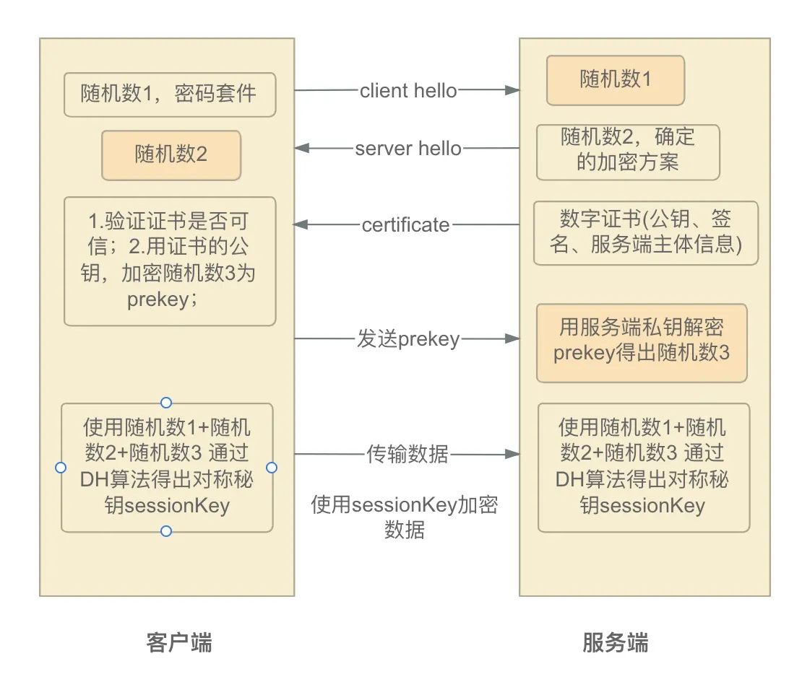

# Tiny SSL VPN

## Introduction
We create a simple SSL VPN server and client using 'rsa' for key exchange and 'chacha20' for data encryption by the reference of basic tls handshakes as the image below.



The server and client can communicate with each other through a secure channel. The server can also push routes to the client.

## Compilation
In Linux, you need to get `libasio-dev` `libspdlog-dev` `libprotobuf-dev` `libgmp-dev` installed. 

In Windows, we recommend you to use `vcpkg` to install `asio` `spdlog` `protobuf` `gmp` and `gmpxx`.

And `zstd` is an option for compression.

You may need to add the routes to the client manually.

## Usage
```shell
$ server <port> [<cert_file> <key_file>]
$ ca <cert_file> [ca_cert_file] [ca_key_file]
$ client <addr> <port> [ca_cert_file]
```

> note: You may need to run the server with `sudo` to use the `tun` device, or Administrator in Windows.

## TODO
- [ ] Exit gracefully
- [ ] Fully test for the TUN device